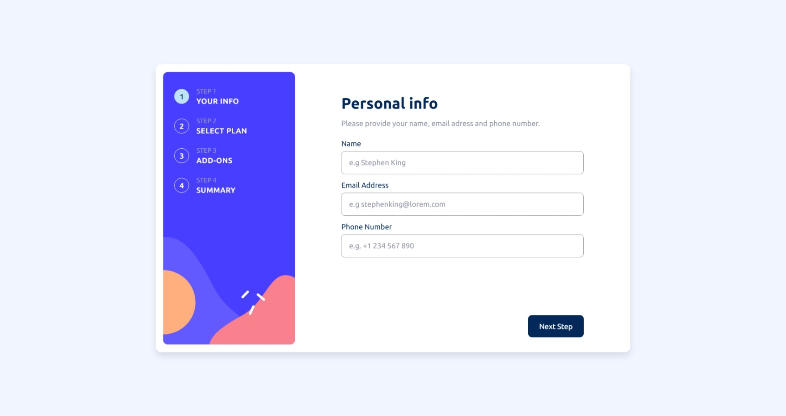

# Frontend Mentor - Multi-step form solution

This is a solution to the [Multi-step form challenge on Frontend Mentor](https://www.frontendmentor.io/challenges/multistep-form-YVAnSdqQBJ). Frontend Mentor challenges help you improve your coding skills by building realistic projects. 

## Table of contents

- [Overview](#overview)
  - [The challenge](#the-challenge)
  - [Screenshot](#screenshot)
  - [Links](#links)
- [My process](#my-process)
  - [Built with](#built-with)
  - [What I learned](#what-i-learned)

**Note: Delete this note and update the table of contents based on what sections you keep.**

## Overview

### The challenge

Users should be able to:

- Complete each step of the sequence
- Go back to a previous step to update their selections
- See a summary of their selections on the final step and confirm their order
- View the optimal layout for the interface depending on their device's screen size
- See hover and focus states for all interactive elements on the page
- Receive form validation messages if:
  - A field has been missed
  - The email address is not formatted correctly
  - A step is submitted, but no selection has been made

### Screenshot



### Links

- Live Site URL: [Live Site](https://multi-step-form-frontendmentors.netlify.app/)

## My process

### Built with

- HTML5 markup
- CSS custom properties
- Flexbox
- CSS Grid
- Mobile-first workflow
- [React](https://reactjs.org/) - JS library
- [Next.js](https://nextjs.org/) - React framework
- [Tailwind CSS](https://tailwindcss.com/) - CSS utility-based framework

### What I learned

- Activity component from react (19.2) allows to hide ui (using display:none) whilst preserving internal state of the component (e.g formdata).

```tsx
<Activity
  mode={stepNum===1 ? "visible" : "hidden"}
>
  <PersonalInfo/>
</Activity>
```

- Can access next sibling in css, using + <element>
```css
.form-error:has(+ input:user-invalid)::after {
  content: 'Please fill in this field';
}
```

- Can use label components to increase area of hitbox of checkbox / radio inputs by wrapping it and linking htmlFor to the input id.
```tsx
<label htmlFor={"Online service"} className="size-40">            
  <input 
      type="checkbox"
      name="addOn"
      id={"Online service"}
      title={"Online service"}
      value={"Online service"} 
      className="size-4"
  />                
</label>
```
